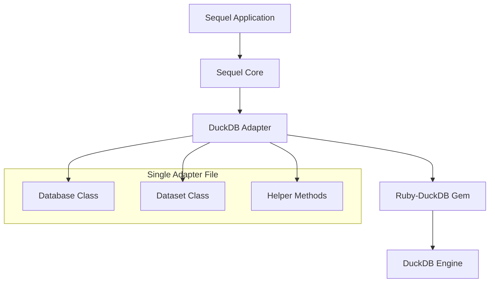

# Design Document

## Overview

The Sequel DuckDB adapter will be implemented as a Ruby gem that extends Sequel's database abstraction layer to support DuckDB databases. The design follows Sequel's established adapter architecture patterns, with jeremyevans/sequel as the primary reference, sequel-hexspace as secondary reference for adapter structure, and sequel_impala as tertiary reference for implementation patterns, while leveraging the official ruby-duckdb gem for low-level database connectivity.

The adapter will be structured following the established Sequel extension pattern with the Sequel::DuckDB namespace, ensuring proper integration with Sequel's testing framework and development workflow.

## Architecture

### High-Level Architecture



### File Structure

Following the sequel-hexspace structure pattern:

```text
lib/
└── sequel/
    ├── duckdb.rb                    # Main module entry point
    ├── duckdb/
    │   └── version.rb               # Version constant
    └── adapters/
        ├── duckdb.rb                # Main adapter file (Database & Dataset classes)
        └── shared/
            └── duckdb.rb            # Shared DuckDB-specific functionality
```

This structure ensures:

- **sequel-hexspace Compatibility**: Follows the exact same structure as sequel-hexspace
- **Proper Adapter Registration**: Uses Sequel's standard adapter loading mechanism
- **Shared Functionality**: Common methods separated into shared/duckdb.rb
- **Mock Database Support**: SQL generation works with Sequel's mock database objects
- **Maintenance Organization**: Clear separation between main adapter and shared utilities

## Components and Interfaces

### Main Adapter Structure

Following sequel-hexspace pattern:

```ruby
# lib/sequel/adapters/duckdb.rb
require 'sequel/adapters/shared/duckdb'

module Sequel
  module DuckDB
    class Database < Sequel::Database
      include Sequel::DuckDB::DatabaseMethods
      set_adapter_scheme :duckdb

      # Core database methods
    end

    class Dataset < Sequel::Dataset
      include Sequel::DuckDB::DatasetMethods

      # SQL generation and query execution
    end
  end

  # Register the adapter
  Database.adapter_scheme :duckdb, DuckDB::Database
end
```

```ruby
# lib/sequel/adapters/shared/duckdb.rb
require 'duckdb'

module Sequel
  module DuckDB
    module DatabaseMethods
      # Shared database functionality
    end

    module DatasetMethods
      # Shared dataset functionality
    end
  end
end
```

### 1. Database Class

**Purpose:** Main database class that handles connections, transactions, and schema operations, following sequel-hexspace structure.

**Key Methods for Mock Database Compatibility:**
```ruby
# lib/sequel/adapters/duckdb.rb
class Sequel::DuckDB::Database < Sequel::Database
  include Sequel::DuckDB::DatabaseMethods
  set_adapter_scheme :duckdb

  # Dataset factory
  def dataset_class_default
    Dataset
  end
end

# lib/sequel/adapters/shared/duckdb.rb
module Sequel::DuckDB::DatabaseMethods
  # Connection management
  def connect(server)
    opts = server_opts(server)
    if opts[:database] == ':memory:'
      ::DuckDB::Database.new
    else
      ::DuckDB::Database.new(opts[:database])
    end
  end

  def disconnect_connection(conn)
    conn.close if conn && !conn.closed?
  end

  def valid_connection?(conn)
    conn && !conn.closed?
  end

  # Schema introspection (works with mock databases)
  def tables(opts = OPTS)
    schema_parse_tables(opts)
  end

  def schema(table, opts = OPTS)
    schema_parse_table(table, opts)
  end

  def indexes(table, opts = OPTS)
    schema_parse_indexes(table, opts)
  end

  # SQL execution
  def execute(sql, opts = OPTS, &block)
    synchronize(opts[:server]) do |conn|
      return execute_statement(conn, sql, opts, &block)
    end
  end

  def execute_insert(sql, opts = OPTS)
    execute(sql, opts)
  end

  def execute_update(sql, opts = OPTS)
    execute(sql, opts)
  end

  private

  # Schema parsing methods (mockable)
  def schema_parse_tables(opts)
    # Query DuckDB system tables or return mock data
  end

  def schema_parse_table(table_name, opts)
    # Parse individual table schema
  end

  def schema_parse_indexes(table_name, opts)
    # Parse table indexes
  end

  def execute_statement(conn, sql, opts, &block)
    # Execute SQL against DuckDB connection
  end
end
```

### 2. Dataset Class

**Purpose:** SQL generation and query execution, fully compatible with Sequel's mock database testing, following sequel-hexspace structure.

**Key Methods for SQL Generation Testing:**
```ruby
# lib/sequel/adapters/duckdb.rb
class Sequel::DuckDB::Dataset < Sequel::Dataset
  include Sequel::DuckDB::DatasetMethods
end

# lib/sequel/adapters/shared/duckdb.rb
module Sequel::DuckDB::DatasetMethods
  # SQL generation (works with mock databases)
  def select_sql
    sql = @opts[:sql]
    return sql if sql

    columns_sql = select_columns_sql
    sql = "SELECT #{columns_sql}"

    if supports_select_all_and_offset? && @opts[:offset]
      sql = select_all_sql(sql)
    end

    select_from_sql(sql)
    select_join_sql(sql)
    select_where_sql(sql)
    select_group_sql(sql)
    select_having_sql(sql)
    select_order_sql(sql)
    select_limit_sql(sql)

    sql
  end

  def insert_sql(*values)
    return static_sql if @opts[:sql]

    columns = insert_columns
    values = insert_values(values)

    "INSERT INTO #{source_list(@opts[:from])} #{literal(columns)} VALUES #{values.map{|v| literal(v)}.join(', ')}"
  end

  def update_sql(values = OPTS)
    return static_sql if @opts[:sql]

    sql = "UPDATE #{source_list(@opts[:from])} SET "
    sql << update_columns_sql(values)
    select_where_sql(sql)
    sql
  end

  def delete_sql
    return static_sql if @opts[:sql]

    sql = "DELETE FROM #{source_list(@opts[:from])}"
    select_where_sql(sql)
    sql
  end

  # Query execution
  def fetch_rows(sql, &block)
    execute(sql) do |result|
      result.each(&block)
    end
  end

  # DuckDB capabilities
  def supports_window_functions?
    true
  end

  def supports_cte?
    true
  end

  def supports_returning?
    false
  end

  def supports_select_all_and_offset?
    true
  end

  def quote_identifiers_default
    true
  end

  private

  # DuckDB-specific SQL generation
  def select_limit_sql(sql)
    if limit = @opts[:limit]
      sql << " LIMIT #{literal(limit)}"
      if offset = @opts[:offset]
        sql << " OFFSET #{literal(offset)}"
      end
    end
  end

  def literal_string_append(sql, s)
    sql << "'" << s.gsub("'", "''") << "'"
  end

  def literal_date(date)
    "'#{date}'"
  end

  def literal_datetime(datetime)
    "'#{datetime.strftime('%Y-%m-%d %H:%M:%S')}'"
  end

  def literal_time(time)
    "'#{time.strftime('%H:%M:%S')}'"
  end

  def literal_boolean(value)
    value ? 'TRUE' : 'FALSE'
  end
end
```

## Data Models

### Connection Configuration

```ruby
# Standard Sequel connection options
{
  adapter: 'duckdb',
  database: '/path/to/database.db',  # or ':memory:' for in-memory
  # DuckDB-specific options can be passed through
  readonly: false,
  config: {
    threads: 4,
    memory_limit: '1GB'
  }
}
```

### Schema Information Format

Following Sequel's standard schema format:

```ruby
# Schema returned by Database#schema
[
  [:id, {
    type: :integer,
    db_type: 'INTEGER',
    allow_null: false,
    default: nil,
    primary_key: true,
    auto_increment: true
  }],
  [:name, {
    type: :string,
    db_type: 'VARCHAR',
    allow_null: true,
    default: nil,
    primary_key: false,
    auto_increment: false
  }]
]
```

## Error Handling

### Error Mapping Strategy

Map DuckDB errors to appropriate Sequel exceptions:

```ruby
# Within Database class
private

def database_error_classes
  [::DuckDB::Error]
end

def database_exception_sqlstate(exception, opts)
  # Extract SQL state from DuckDB error if available
end

def database_exception_use_sqlstates?
  true
end
```

## Testing Strategy

### Mock Database Support

The single-file structure ensures full compatibility with Sequel's mock database testing:

```ruby
# Test example
DB = Sequel.mock(host: 'duckdb')
DB.extend_datasets(Sequel::DuckDB::Dataset)

# SQL generation tests work without real database
dataset = DB[:users].where(name: 'John')
dataset.sql.should == "SELECT * FROM users WHERE (name = 'John')"
```

### Test Structure

Following sequel-hexspace test organization exactly:

```
test/
├── all.rb                       # Test runner
├── spec_helper.rb               # Test configuration and setup
├── database_test.rb             # Database connection and basic functionality tests
├── dataset_test.rb              # Comprehensive SQL generation tests
├── schema_test.rb               # Schema operations and introspection tests
├── prepared_statement_test.rb   # Prepared statement functionality
├── sql_test.rb                  # SQL generation and syntax tests
└── type_test.rb                 # Data type handling tests
```

### Test Categories

1. **SQL Generation Tests**: Use mock databases to test SQL output
2. **Integration Tests**: Use real DuckDB databases for end-to-end testing
3. **Schema Tests**: Test schema introspection with various table structures
4. **Type Conversion Tests**: Test Ruby ↔ DuckDB type mapping
5. **Error Handling Tests**: Test proper exception mapping

## Performance Considerations

### Connection Management

- Use DuckDB's connection pooling capabilities
- Handle connection lifecycle properly
- Support both file and in-memory databases efficiently

### Query Optimization

- Leverage DuckDB's columnar storage advantages
- Support DuckDB's parallel query execution
- Use appropriate data types for optimal performance

### Memory Management

- Handle large result sets efficiently
- Support streaming results where possible
- Use DuckDB's memory-mapped file capabilities

## Security Considerations

### SQL Injection Prevention

- Use parameterized queries through Sequel's literal system
- Proper identifier quoting
- Input validation and sanitization

### Connection Security

- Support read-only database connections
- Proper handling of database file permissions
- Secure connection string parsing

## Deployment and Distribution

### Gem Structure

Following sequel-hexspace structure:

```text
sequel-duckdb/
├── lib/
│   └── sequel/
│       ├── duckdb.rb                    # Main module entry point
│       ├── duckdb/
│       │   └── version.rb               # Version constant
│       └── adapters/
│           ├── duckdb.rb                # Main adapter file (Database & Dataset classes)
│           └── shared/
│               └── duckdb.rb            # Shared DuckDB-specific functionality
├── test/                                # Test suite following sequel-hexspace pattern
├── README.md
├── CHANGELOG.md
├── LICENSE
├── sequel-duckdb.gemspec
└── Gemfile
```

### Dependencies

- **sequel**: Core Sequel gem (>= 5.0)
- **ruby-duckdb**: Official Ruby DuckDB client library
- **ruby**: Minimum Ruby version 3.1.0

### Compatibility Matrix

| Component   | Version Requirements |
| ----------- | -------------------- |
| Ruby        | >= 3.1.0             |
| Sequel      | >= 5.0               |
| DuckDB      | >= 0.8.0             |
| Ruby-DuckDB | >= 0.8.0             |

This design ensures the adapter follows Sequel's established patterns while providing full DuckDB functionality and maintaining compatibility with Sequel's testing framework and mock database support.